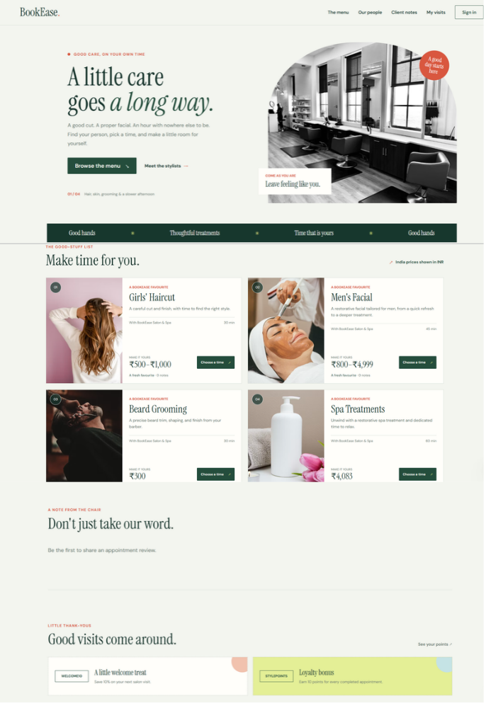

# BookEase Salon & Spa

A salon and spa appointment booking app for haircuts, facials, beard grooming, and spa treatments, built with vanilla JavaScript, Express, and MySQL.

## Live Demo

[Live Demo-BookEase video](https://drive.google.com/file/d/1TtU8xkdSEcjxfyzZAayRRcqfpLw6lXUg/view?usp=drive_link)

## Screenshot



## Project layout

```text
.
├── db.js
├── middleware/
│   ├── auth.js
│   └── errors.js
├── public/
│   ├── app.js
│   ├── booking.html
│   ├── dashboard.html
│   ├── index.html
│   └── styles.css
├── routes/
│   ├── auth.js
│   ├── bookings.js
│   └── services.js
├── schema.sql
├── server.js
└── .env.example
```

## Setup

Requirements: Node.js 20+ and MySQL 8+.

1. Create the database and tables by running `schema.sql` in MySQL. If BookEase is already installed, run the updated script again to add the profile, review, and offers tables.
2. Copy `.env.example` to `.env`; set the MySQL connection values and a random `JWT_SECRET` of at least 32 characters.
3. Run `npm install`, then `npm start` (or `npm run dev` during development).
4. Open [http://localhost:3000](http://localhost:3000).

New accounts are customers. To create a provider account, register normally, then promote that account through a trusted database administrator (replace the email below):

```sql
UPDATE users SET role = 'provider' WHERE email = 'provider@example.com';
```

Sign in as the provider, create services in the dashboard, and configure weekly hours there. Create admin users only through a trusted administrative process; never enable public role selection.

Providers can manage up to six working windows per weekday from the dashboard.

SMTP is optional. When `SMTP_HOST` is configured, the app sends a booking request email to the customer; mail delivery failures are logged without undoing a saved appointment.

## Profiles, reviews, and rewards

Customers and providers can update their name, contact details, city, bio, and profile photo from the dashboard. Profile images accept JPEG, PNG, or WebP files up to 5 MB and are stored in `public/uploads`. Providers can also add a specialty, which appears in the public stylist directory. Customers can rate and review completed appointments once per booking. Active promotional offers appear in the catalog; customer loyalty points are calculated as 10 points per completed appointment.

Prices are stored in USD, with optional India-specific INR price bands for services that need them. The browser checks the visitor's IP-based country through ipapi.co and, for visitors in India, uses the exact service band when one is set; otherwise it applies the existing 50% India-market factor to the converted USD price. INR prices are rounded to whole rupees. If location or rate lookup is unavailable, prices remain in USD (or use a previously cached rate for up to seven days).

For an existing database, run `migrations/20260929_india_service_pricing.sql` once. It creates the India price columns, sets the requested haircut/facial/beard rates, preserves the spa's USD base price, and keeps its established ₹4,083 India price. New databases include the price columns in `schema.sql`.

## API

- `POST /api/auth/register`, `POST /api/auth/login`
- `GET /api/services`, `POST /api/services` (provider)
- `GET /api/availability`, `PUT /api/availability` (provider)
- `GET /api/bookings/available-slots?service_id=1&date=YYYY-MM-DD`
- `POST /api/bookings` (customer)
- `GET /api/bookings/my-bookings` (authenticated)
- `PATCH /api/bookings/:id/status` (provider/admin; customers may cancel only their own bookings)
- `GET/PUT /api/profile/me`, `GET /api/profile/stylists`
- `GET /api/reviews/latest`, `GET /api/reviews/mine`, `POST /api/reviews` (completed customer bookings only)
- `GET /api/offers`, `GET /api/offers/loyalty/me`

Available appointment slots are generated from the stylist's weekly working hours using each service's own duration. Booking creation derives the end time from that duration, verifies the provider's weekly availability, and checks for overlapping bookings across all of the stylist's services in a transaction while locking the provider row. This prevents a client from booking a haircut and facial with the same stylist at overlapping times, including concurrent requests.
